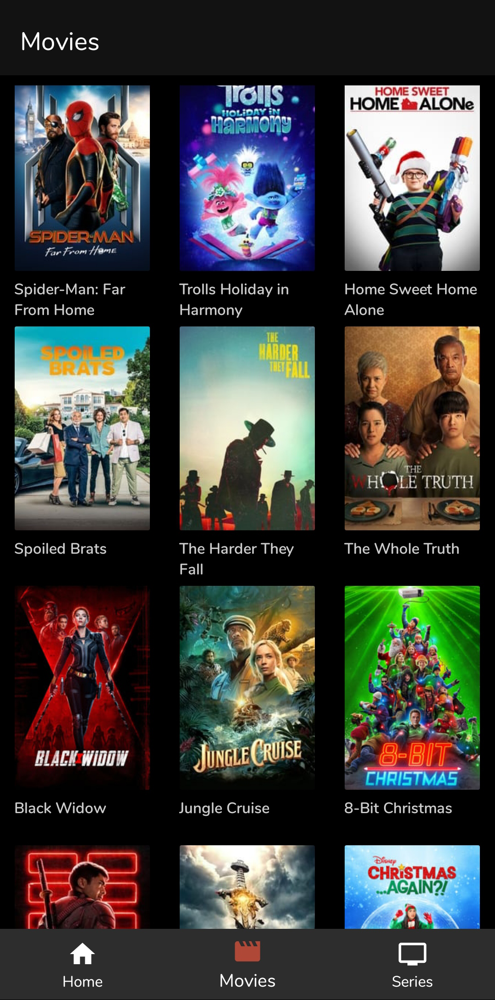
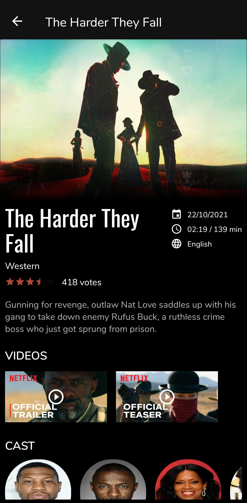
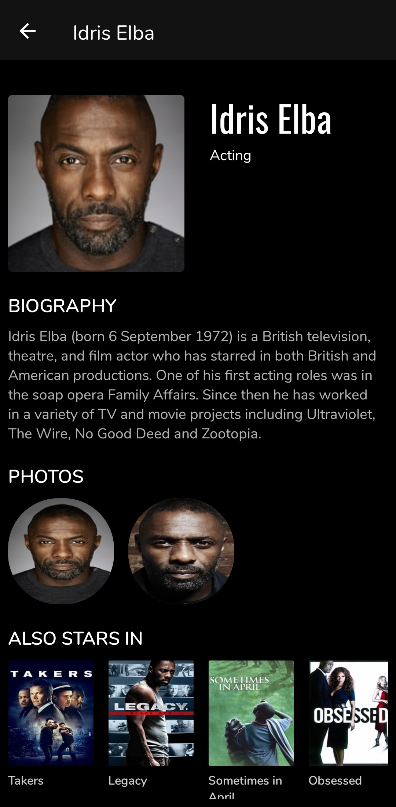
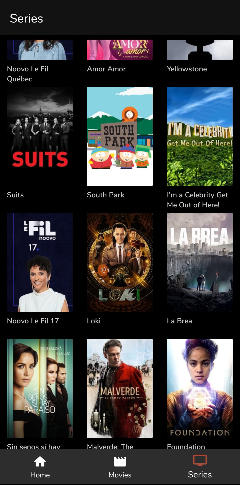

# Movie App

<!--  -->

The name? I know. That's why its a very basic app created initially for my sister. The name might change if she comes up with something creative😄🚀

[](https://github.com/carolinemusyoka/MovieApp/blob/master/app/app-debug.apk?raw=true)
[](https://github.com/carolinemusyoka/MovieApp/blob/master/app/build.gradle)
[](https://github.com/carolinemusyoka/MovieApp/blob/master/app/build.gradle)
[](https://github.com/carolinemusyoka/MovieApp/blob/master/app/build.gradle)
[](https://github.com/carolinemusyoka/MovieApp/blob/master/app/build.gradle)
[](https://github.com/carolinemusyoka/MovieApp/blob/master/LICENSE)

## Features
* 100% Kotlin
* Android architecture components and Jetpack libraries
* Single activity pattern
* Testing (Upcoming)

  ## Screenshots
<p align="center">

 
 

 
 
</p>

## Tech Stacks
* [Retrofit](http://square.github.io/retrofit/) + [OkHttp](http://square.github.io/okhttp/) - RESTful API and networking client.
* [Android Architecture Components](https://developer.android.com/topic/libraries/architecture) - A collections of libraries that help you design rebust, testable and maintainable apps.
    * [Paging](https://developer.android.com/topic/libraries/architecture/paging) - Pagination loading for RecyclerView.
    * [ViewModel](https://developer.android.com/reference/androidx/lifecycle/ViewModel) - UI related data holder, lifecycle aware.
    * [LiveData](https://developer.android.com/topic/libraries/architecture/livedata) - Observable data holder that notify views when underlying data changes.
    * [Data Binding](https://developer.android.com/topic/libraries/data-binding) - Declarative way to bind data to UI layout.
    * [Navigation component](https://developer.android.com/guide/navigation) - Fragment routing handler. (Upcoming)
    *  [Coroutine](https://developer.android.com/kotlin/coroutines) Concurrency design pattern for asynchronous programming.

## API Key 🔑

You will need to provide developer key to fetch the data from TMDB API.
* Generate a new key (v3 auth) from [here](https://www.themoviedb.org/settings/api). Copy the key and go back to Android project.
* Add the key in `gradle.properties` file by defining it as `TMDB_API_KEY` with the double quotes, so it looks like

```kotlin
TMDB_API_KEY = "YOUR_KEY_HERE"
```

* Perform gradle sync.


https://user-images.githubusercontent.com/44951692/145691930-b9086004-66ea-4407-96c1-5717c331e44e.mp4


Project Roadmap

- [x] Creating a new Movie app project
- [x] Working with the API to fetch data
- [x] Adding Paging 3
- [x] Pretty Basic UI..planning to come up with a new one (As you might have noticed, add categories ie with genres)
- [ ] Code restructure
- [ ] Upload on playstore
