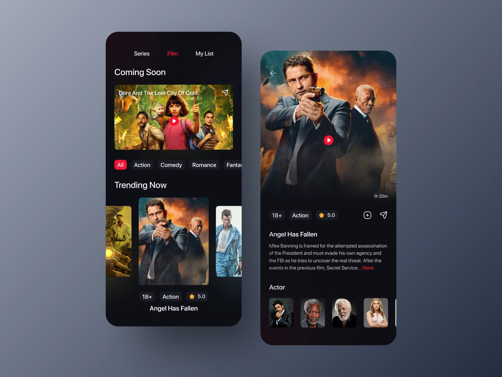

# MovieApp
A basic movie app to help me grasp some android tech stacks etc

# Project RoadMap

- [x] Creating a new Movie app project
- [x] Working with the API to fetch data
- [x] Adding Paging 3
- [x] Pretty Basic UI..planning to come up with a new one

I want to be able to have this kind of UI

#Libraries used
- LifeCycle
- ViewModel
- Paging 3
- Room (Soon to be used)
- ViewPager Indicator
- Lottie Animations (Soon to be used)
- Coroutines
- Retrofit with gson
- okhttp for logging
- Glide
- Jetpack Navigation
- Material UI
- Datastore (Soon to be used)
